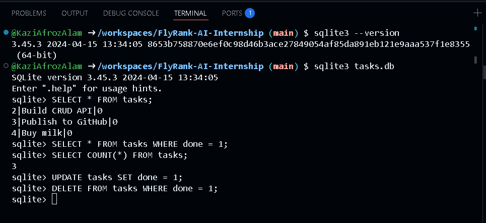
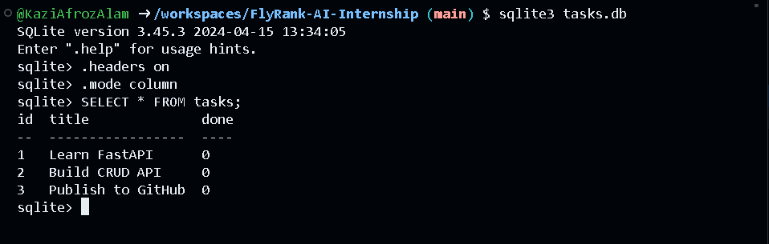
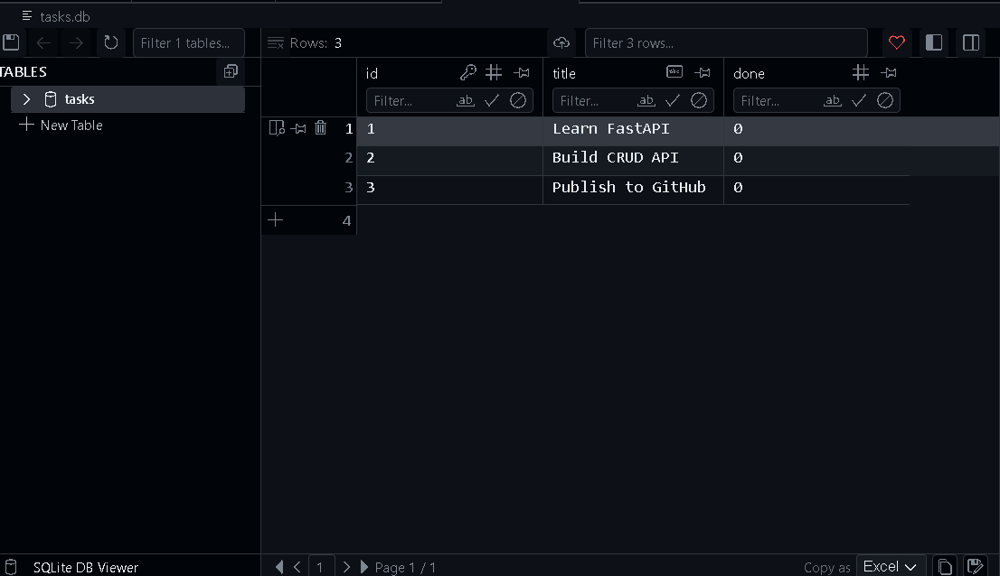
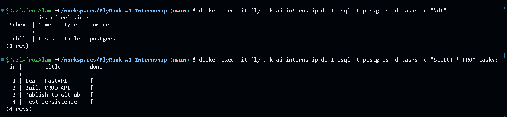

# Task API

A simple CRUD API for managing a to-do list, built with FastAPI. Tasks are stored in memory (no database yet).

## What this is

This API lets you create, read, update, and delete tasks (the four CRUD operations) over HTTP. It was built as part of the FlyRank Backend Internship, Week 2 assignment.

## How to install & run

1. Install dependencies:
```bash
   pip install fastapi uvicorn
```
2. Run the server:
```bash
   uvicorn main:app --reload
```
3. Open your browser to `http://localhost:8000` to confirm it's running, or `http://localhost:8000/docs` for interactive API docs.

## Endpoints

| Method | Path            | Description                     |
|--------|-----------------|---------------------------------|
| GET    | `/`             | API info                        |
| GET    | `/health`       | Health check                    |
| GET    | `/tasks`        | List all tasks                  |
| GET    | `/tasks/{id}`   | Get a single task by ID         |
| POST   | `/tasks`        | Create a new task               |
| PUT    | `/tasks/{id}`   | Update a task's title/done      |
| DELETE | `/tasks/{id}`   | Delete a task                   |

## Example request

```bash
curl -i -X POST http://localhost:8000/tasks -H "Content-Type: application/json" -d '{"title":"Buy milk"}'
```

**Response:**
```
HTTP/1.1 201 Created
date: Wed, 15 Jul 2026 10:30:00 GMT
server: uvicorn
content-length: 46
content-type: application/json

{"id":4,"title":"Buy milk","done":false}
```


## Swagger UI

The interactive API documentation is available at **`/docs`** once the server is running.

Below are screenshots of the Swagger UI demonstrating the available endpoints and CRUD operations.

### Screenshot 1


### Screenshot 2


### Screenshot 3


### Screenshot 4


### Screenshot 5


### Screenshot 6


### Screenshot 7


### Screenshot 8


### Screenshot 9


## Database

This project now stores tasks in **SQLite** instead of an in-memory list.

**Why SQLite:** it's a single file with zero setup — no server to install or configure — and it survives restarts, unlike the in-memory list used in Assignment 1.

**Where it lives:** `tasks.db`, created automatically the first time the app runs. It's git-ignored, so each fresh clone starts with a clean database.

**Run it:**
```bash
pip install fastapi uvicorn
uvicorn main:app --reload
```
On first run, `tasks.db` is created automatically with the `tasks` table and 3 seeded example tasks.

**Exploring the database by hand:**
Since I worked in a browser-based Codespace, I used the SQLite CLI instead of DB Browser:
```bash
sqlite3 tasks.db
```
Example query run:
```sql
SELECT COUNT(*) FROM tasks;
```
This returned `3`, confirming the table held exactly the 3 seeded tasks before I explored `UPDATE`/`DELETE` behavior.





*Viewed using a browser-based SQLite viewer in Codespaces, showing the `tasks` table with 3 seeded rows.*



## AI vs Me — Stage 6

**My prompt:**
I have a CRUD Task API that currently stores tasks in memory. I want you to migrate only the storage layer to SQLite while keeping the API behavior exactly the same. 

My project uses:- FastAPI (Python) with the built-in sqlite3 library.

 Requirements:
 1. Create a SQLite database named tasks.db automatically if it doesn't exist.
 2. Create a table named tasks if it doesn't already exist with these columns: 
      - id INTEGER PRIMARY KEY AUTOINCREMENT
      - title TEXT NOT NULL
      - done INTEGER NOT NULL
 3. Seed exactly three example tasks only if the table is empty. Restarting the    application must never duplicate the seed data.
 4. Keep the existing API endpoints unchanged:
   - GET /tasks
   - GET /tasks/{id}
   - POST /tasks
   - PUT /tasks/{id}
   - DELETE /tasks/{id}
 5. Preserve the same request and response formats and the same status codes:
   - 200 for successful GET and PUT
   - 201 for successful POST
   - 204 for successful DELETE
   - 400 for invalid or missing title
   - 404 when a task ID does not exist
  6. Use parameterized SQL queries for every database operation. Never concatenate user input into SQL strings.
  7. The API should continue to behave exactly as before. Only replace the in-memory storage with SQLite.
  8. The database should persist data between server restarts. Return the complete updated code with clear comments explaining the database changes.

**What the AI did better:**
1. Fixed a real inconsistency in my code — POST returned `done` as a proper boolean while GET returned it as a raw 0/1 integer from SQLite. The AI added a `row_to_task()` helper to normalize every response to a real boolean.
2. Wrapped every database operation in `try/finally` so the connection always closes, even if a query raises an exception — my version could leak connections on error.
3. Used `Path(__file__).with_name("tasks.db")` instead of a relative string path, so the database always resolves next to `main.py` regardless of the working directory the server is launched from.

**What it got wrong or ignored:**
- Nothing broke the required behavior — endpoints, status codes, and parameterized queries all matched my spec exactly.

**What my prompt forgot to specify:**
- Whether `done` should be returned as an int or a bool — the AI resolved this ambiguity on its own by picking bool everywhere, which actually fixed a real bug in my original code.
- Connection-safety expectations (try/finally) — I didn't think to ask for this, but it's clearly better practice.

## Running Postgres

Start the database container:
```bash
docker run --name taskdb -e POSTGRES_PASSWORD=dev -e POSTGRES_DB=tasks \
  -p 5432:5432 -v taskdata:/var/lib/postgresql/data -d postgres:16
```

## Running the full stack (Docker + Postgres)

This project now runs against a real PostgreSQL database, containerized with Docker, and the whole stack (app + database) starts with a single command.

**Setup:**
```bash
cp .env.example .env
docker compose up
```

**Environment variables** (see `.env.example`):
- `DATABASE_URL` — Postgres connection string, e.g. `postgres://postgres:dev@db:5432/tasks`

**Endpoints:**

| Method | Path            | Description                     |
|--------|-----------------|---------------------------------|
| GET    | `/`             | API info                        |
| GET    | `/health`       | Health check                    |
| GET    | `/tasks`        | List all tasks                  |
| GET    | `/tasks/{id}`   | Get a single task by ID         |
| POST   | `/tasks`        | Create a new task               |
| PUT    | `/tasks/{id}`   | Update a task's title/done      |
| DELETE | `/tasks/{id}`   | Delete a task                   |

**Example request:**
```bash
curl -i http://localhost:8000/tasks
```
HTTP/1.1 200 OK
content-type: application/json

[{"id":1,"title":"Learn FastAPI","done":false},{"id":2,"title":"Build CRUD API","done":false},{"id":3,"title":"Publish to GitHub","done":false}]

**Persistence:** data survives a full stack restart (`docker compose down` then `docker compose up`), because Postgres's data lives in a named volume (`taskdata`) that outlives the containers.

**Note on Postgres version:** this project pins `postgres:16` rather than the `latest` tag. Postgres 18+ images changed their data directory layout in a way that's incompatible with the simple volume mount used here — pinning to 16 avoids that issue while still being a fully current, supported version.



## Stretch goals

**Real health check:** `/health` now runs `SELECT 1` against the database before responding. If the database is unreachable, it returns `503` instead of a false "ok" — a load balancer or orchestrator polling this endpoint uses it to decide whether to route traffic to this instance, pulling it out of rotation if the check fails.

**The mortality experiment:** ran Postgres without a volume, created a table and inserted a row, then removed and recreated the container with identical settings. The data was completely gone — `SELECT * FROM demo` returned `relation "demo" does not exist`. This is exactly why `taskdata` is mounted as a volume in `compose.yaml`: without it, a container's data dies the moment the container itself is removed.

## Week 4 – Authentication & Authorization

This week focuses on implementing secure user authentication and authorization using **Supabase Auth** with **FastAPI**.

### Features
- User registration with email and password
- User login with JWT access and refresh tokens
- Protected API endpoints using Bearer authentication
- Public and private API routes
- JWT token validation via Supabase
- Interactive Swagger UI with **Authorize** (Bearer Token) support

### Swagger UI


